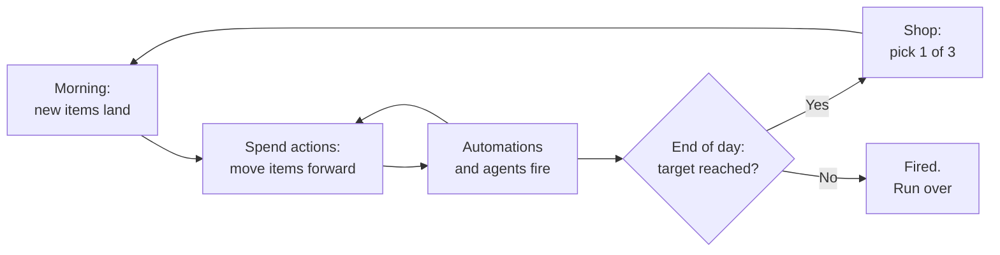
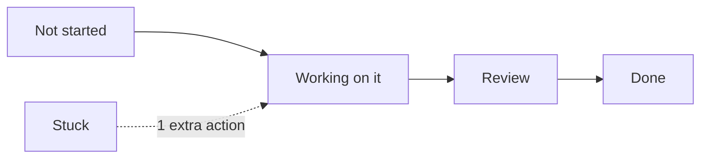

# All A Board! — Game Spec

Sep 25, 2026 · @Orr Segev

## Overview

All A Board! is a monday-board based, run-based engine-builder played on a single work board. You manage a cruise liner's task board, one workday at a time. 
Hit each day's point target or get thrown overboard.

| Field | Value |
| --- | --- |
| Genre | Roguelike engine-builder (like Balatro) |
| Theme | Cruise liner run on a Monday-style board |
| UI | Project Board, one screen: the board |
| Input | Mouse + Keyboard |
| Run length | 15-25 minutes |
| Audience | Monday.com users and employees |
| Platform | Browser |

**Design pillars**

- **The board is the game.** No map, no characters, no art.
- **Combos are the fun.** Automations trigger each other. Players hunt for broken chains.
- **Every run is different.** Random items, random shop.
- **Inside jokes.** Item names and events are Monday humor.

## Core loop

A run is a cruise of up to 10 workdays. Each day is one round. Between days, you shop.



The player's only decision each turn: **which item to move next.** Everything else is the engine they built.

**A turn**

1. Player picks an item and spends 1 action.
2. The item moves one status forward.
3. Triggers fire, in slot order (left to right).
4. Points and coins update on screen.

## The board

One board, four groups (ship departments). Each item has a status, a deadline and a point value.

```
DAY 4 · Actions 6/6 · Target 120 · Score 0 · Coins 7
GALLEY
 ▸ Breakfast buffet   [Working on it]  today     15pt
 ▸ Allergy order      [Stuck]          today     25pt
CABINS
 ▸ Broken AC #214     [Not started]    tomorrow  20pt
ENGINE ROOM
DECK
AUTOMATIONS [3/5]: Auto-assign · Stuck→Alert · Done→Bonus
AGENTS [1/2]: Intern Bot
```

**Groups:** Galley, Cabins, Engine Room, Deck. Some automations only work in one group.

**Status track** (each action moves an item one step)



**Item fields**

| Field | Values | Notes |
| --- | --- | --- |
| Status | Not started, Working on it, Review, Done, Stuck | Stuck costs 1 extra action to clear |
| Deadline | Today, Tomorrow, Day+2 | Overdue items lose points each day |
| Points | 5–40 | Paid when the item reaches Done |
| Tag | Normal, Urgent, VIP, Bug | Tags are what automations react to |

**Rules**

- Board size cap: 12 items. New items that don't fit are lost (−10 pts each).
- Done items leave the board at the end of the day.
- Overdue items stay and lose 5 pts per day.

## Days, targets and failure

Targets grow about 35% per day. Manual play alone fails around day 4, so players must invest in automations early.

| Day | New items | Target (pts) | Special |
| --- | --- | --- | --- |
| 1 | 4 | 60 | Tutorial hints |
| 2 | 5 | 80 |  |
| 3 | 5 | 110 |  |
| 4 | 6 | 150 |  |
| 5 | 6 | 200 | Boss day |
| 6 | 7 | 260 |  |
| 7 | 8 | 340 |  |
| 8 | 8 | 440 |  |
| 9 | 9 | 570 |  |
| 10 | 10 | 750 | Final boss |

- **Actions per day:** 6 (can be raised by automations).
- **Fail:** score below target at end of day. The run ends.
- **Win:** survive day 10. Endless mode unlocks after the first win.
- **Boss days** add one rule for that day, for example:
  - *Quarterly Review:* Review takes 2 actions.
  - *Re-org:* all items shuffle to random groups.
  - *Quick Sync:* you start with 3 actions.
  - *Freeze:* automations fire only once each.

## Automations

Automations are permanent "When X → do Y" rules. They are the main source of power and fun. The player has 5 slots; slot order is fire order.

**Model:** trigger + optional condition + effect.

- **Triggers:** item arrives, item moves, item Done, item Stuck, day start, day end
- **Effects:** +points, ×points, +coins, +actions, move an item, clear Stuck
- **Loop guard:** each automation fires max 5 times per turn; max 50 triggers per turn in total

**Starter set (20)**

| # | Name | Rule | Rarity | Cost |
| --- | --- | --- | --- | --- |
| 1 | Done → Bonus | When an item is Done → +5 pts | Common | 3 |
| 2 | Auto-assign | When an item arrives → move it to Working on it | Common | 3 |
| 3 | Stuck → Alert | When an item gets Stuck → +1 action | Common | 3 |
| 4 | Daily Standup | Day start → move 2 random items forward | Common | 3 |
| 5 | Galley Rush | When a Galley item moves → +3 pts | Common | 3 |
| 6 | Room Service | Cabin items give ×1.5 pts | Common | 3 |
| 7 | Fast Track | When an Urgent item is Done → +1 action | Common | 3 |
| 8 | Bug Squash | Bug items skip Review | Common | 3 |
| 9 | Domino | When an item is Done → move 1 random item forward | Uncommon | 5 |
| 10 | Momentum | When an item moves → +1 pt per move already made this turn | Uncommon | 5 |
| 11 | Mirror Status | When an item moves → the item below it moves too | Uncommon | 5 |
| 12 | Sprint Bonus | Every 3rd item Done today → +1 action | Uncommon | 5 |
| 13 | Overtime | Day end → +2 actions tomorrow, −10 pts now | Uncommon | 5 |
| 14 | VIP Lounge | VIP items give ×2 pts | Uncommon | 5 |
| 15 | Clear Blockers | Day start → clear all Stuck items | Uncommon | 5 |
| 16 | Chain Reaction | 3+ triggers in one turn → ×2 pts for that turn | Rare | 8 |
| 17 | Crossover | When a Deck item is Done → move all Galley items forward | Rare | 8 |
| 18 | Compound Interest | Day end → +1 coin per 5 unspent coins | Rare | 8 |
| 19 | Recurring Task | When an item is Done → a copy returns tomorrow | Rare | 8 |
| 20 | Infinite Loop | When an item reaches Review → send it back, +10 pts (max 3 per turn) | Rare | 8 |

**Designed synergies**

- **Chain engine:** Domino + Mirror Status + Momentum + Chain Reaction. One click can clear half the board.
- **Tempo engine:** Auto-assign + Daily Standup + Sprint Bonus. Many small, fast wins.
- **Department build:** Galley Rush + Crossover + Recurring Task. A focused, high-value group.
- **Economy build:** Compound Interest + Overtime. Weak early, strong late.

## Agents

Agents act by themselves after every player action. They are stronger than automations but unpredictable, and cost coins every day (upkeep). The player has 2 agent slots.

| Name | What it does | Downside | Cost | Upkeep/day |
| --- | --- | --- | --- | --- |
| Intern Bot | Moves 1 random item forward per turn | Ignores deadlines | 4 | 1 |
| Unblocker | Clears 1 Stuck item per turn | Does nothing if nothing is Stuck | 5 | 1 |
| Overachiever | ×2 pts on the item you just moved | 20% chance to mark it Stuck | 6 | 2 |
| Hype Agent | +15 pts per VIP item Done | Adds 1 extra VIP item each morning | 6 | 2 |
| Optimizer 3000 | Reorders your automation slots for max score each turn | Occasionally "optimizes" one away for the day | 9 | 3 |

**Rules**

- Agents act in slot order, after automations.
- Can't pay upkeep → the agent quits.
- Agent text lines add humor: "Intern Bot moved 'Broken AC' to Review. It is still broken."

## Shop and economy

The shop opens after each successful day. The player picks from 3 random offers or saves coins.

**Earning coins**

- +3 coins base per day survived
- +1 coin per 25 pts above the target
- Some automations add coins

**Shop options**

| Action | Cost |
| --- | --- |
| Buy an automation or agent | 3–9 (by rarity) |
| Reroll the 3 offers | 2, +1 each time that day |
| Sell an owned automation | Half its price |
| Upgrade: +1 action per day | 10 (once per run) |
| Upgrade: +1 automation slot | 12 (once per run) |

**Shop odds:** Common 60%, Uncommon 30%, Rare 10%. Rare odds rise by 2% per day.

## Retention

Three hooks bring players back: new content, a shared daily challenge, and office bragging rights.

- **Unlocks:** the first run offers 12 automations. Each finished run unlocks 2–3 more, based on milestones (e.g. "Trigger 20 automations in one turn" unlocks Chain Reaction).
- **Daily Cruise:** one fixed seed per day. Everyone gets the same items and shop. One attempt only.
- **Leaderboard:** daily and all-time, by days survived, then total points. Show the winning build (automation list) so others can copy it.
- **Achievements with office jokes:** "Inbox Zero" (end a day with an empty board), "Per My Last Email" (fail on day 1).

## Tone and flavor text

Dry office humor on a cruise ship. Text replaces art, so every line should earn a smile.

**Item name examples**

| Group | Items |
| --- | --- |
| Galley | Gluten-free everything · Captain wants "something light" · Buffet refill (again) |
| Cabins | Towel swan collapsed · Guest locked out of #214 · Wi-Fi "slow" |
| Engine Room | Strange noise, probably fine · Update the firmware · Who unplugged this? |
| Deck | Pool party (VIP) · Karaoke night · Deck chair diplomacy |

**Log lines** (one short line per event, shown under the board)

- "Domino moved 'Karaoke night' to Done. Nobody asked for this."
- "Allergy order is Stuck. Chef says it was always like this."
- "Day 5: The Quarterly Review is here. Everything needs a second look."

**Rule:** keep item names under 30 characters so the board stays readable on mobile.

## Technical design

The whole game is a small event engine plus a text renderer. Automations are data, not code, so new ones cost minutes to add.

**Stack:** one HTML page, vanilla JS or TypeScript. No framework needed. The leaderboard needs a tiny backend (e.g. Supabase or a Google Sheet endpoint).

**State**

```
GameState { day, actions, score, target, coins, seed,
            items[], automations[5], agents[2], log[] }
Item      { id, name, group, status, deadline, points, tag }
```

**Automation as data**

```json
{
  "id": "domino",
  "trigger": "item_done",
  "condition": null,
  "effect": { "type": "move_random", "count": 1 },
  "rarity": "uncommon",
  "cost": 5,
  "log": "Domino pushed '{item}' forward."
}
```

**Event loop**

1. Player action creates an event (e.g. `item_moved`).
2. The event goes into a queue.
3. For each event: check every automation in slot order; matching effects create new events.
4. Process the queue until empty, or until the loop guard stops it (50 triggers).
5. Agents act. Then render.

**Randomness:** a seeded RNG (e.g. mulberry32). The same seed gives the same run, which enables the Daily Cruise and replays.

**Tuning with data:** log every run (seed, day reached, score per day, build). Use it to tune targets and automation power. A simple bot that plays random runs can test balance before humans do.

## MVP scope and milestones

The MVP answers one question: are the combos fun? Everything else waits.

| Milestone | Scope | Done when |
| --- | --- | --- |
| M1 · Playable board | Board, statuses, actions, 5 days, targets | You can win or lose a run |
| M2 · Engine | Event queue + 10 automations, shop | You find one combo that surprises you |
| M3 · Content | All 20 automations, 5 agents, 2 boss days, flavor text | 3 colleagues play twice without being asked |
| M4 · Retention | Unlocks, Daily Cruise seed, leaderboard | Colleagues compare scores in Slack |
| M5 · Polish | Balance from run data, achievements, mobile layout | Stable targets across 100 bot runs |

**Out of scope for now:** graphics, sound, multiplayer, accounts.

## Risks and open questions

**Risks**

| Risk | Mitigation |
| --- | --- |
| Early days are boring before the first combo | Give one free automation at run start; keep day 1–2 short |
| One combo breaks the game | Loop guard, then tune from run logs. Some broken combos are fine: it's a gag game |
| Text UI feels flat | Animate status changes and log lines (color, short delays) |
| Brand use (name, UI look) inside the company | Ask marketing before sharing beyond your team |

**Open questions**

- [ ] Is 10 days the right run length, or should runs be endless from the start?
- [ ] Should the player be able to reorder automation slots mid-day?
- [ ] Where does the leaderboard live: a web backend or a Monday board via API?
