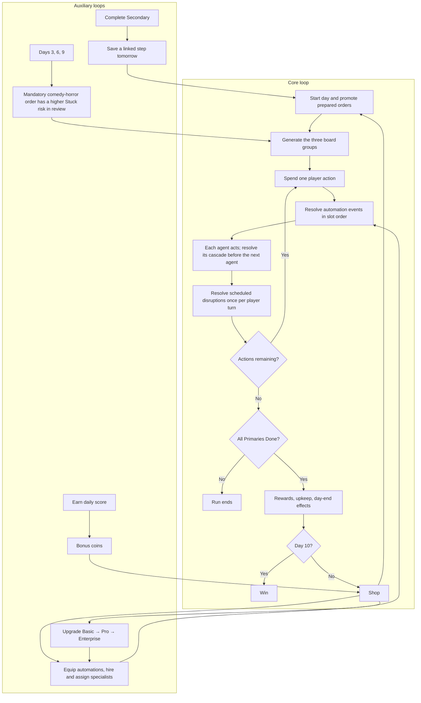

# All A Board! — implemented design

This document supersedes conflicting mechanics in the original brainstorming specification. The original file is preserved for context.

## Workday loop

Every work order begins Pending and follows Pending → Working on it → In review → Done. Primary orders are required today; all must reach Done. Secondary tasks use the same track and, when completed, prepare a named Primary for tomorrow by removing one step from its first advance. Recurring orders are optional score work. Six actions per day, a ten-day run, and score rather than survival targets fund the shop.

An order may become Stuck while moving out of In review. This pauses the board with a department-themed micro-scenario. The player must resolve it by paying 3 coins for outside help or spending 2 actions for an in-house response; either route completes the task. Bosses have a higher Stuck chance at review.

## Capacity and economy

| Tier | Automations | Agents | Cost |
|---|---:|---:|---:|
| Basic | 2 | 0 | Free |
| Pro | 5 | 2 | 8 coins |
| Enterprise | 8 | 4 | 16 additional coins |

Start with Auto-assign, zero coins, and two Primaries. New cruises use `balanceVersion: 2` and the tuned workload `2, 2, 3, 3, 4, 5, 6, 7, 9, 10` for days 1–10. Existing saved cruises without this balance version retain the old two/three-Primary curve and shop behavior. A Boss Task replaces one Primary on days 3, 6, and 9. Successful days award `3 + primaryCount + floor(dayScore / 40)` coins, then pay agent upkeep in slot order. An unpaid agent leaves. Overtime spends after upkeep and never spends on the final day. Tiers, enabled rules, ordering, sales, and department assignments can change only at port. Purchases beyond active automation capacity enter reserve. Sales return half cost rounded down. Rerolls cost 2 coins, then one more per reroll that shop.

New shops guarantee an unowned Daily Standup, Fast Track, Overtime, or Crossover among their three offers while any remain. The existing five-fires-per-cascade limit still applies to Auto-assign: on crowded mornings it advances the first five arriving Primaries. Its total morning contribution is displayed explicitly.

## Forecast disruptions

Days 1–3 have none; days 4–6 have one after player turn 2; days 7–10 have two distinct events after turns 2 and 4. Event selection uses a separate seed derived from the cruise seed and day. Port forecasts show tomorrow’s exact mandatory workload, departments, Boss Task, and scheduled disruptions before shopping or assigning crew. The board repeats the schedule with countdowns.

- Mandatory all-hands removes one remaining action, clamped to zero, without activating agents.
- Health inspection resets unfinished Galley work in every lane to Pending. Done work stays Done. Resets grant no effects, rewards, or preparation credit; consumed preparation steps cannot be reused.
- Department briefing causes each matching assigned agent to skip its next scheduled turn. Passive perks remain active. Skips expire at the next day.

A player turn includes all cascades, agents, and any required Stuck resolution. The engine persists its remaining agent slot and cascade context across an incident, then resolves scheduled events once before automatic day-end evaluation. Incident payments and action refunds do not advance the turn clock. Ending a successful day early avoids later events.

The curve and simulation evidence are recorded in `balance-validation.md`. After playtesting, Pro was reduced from 12 to 8 coins and Enterprise from 24 to 16 coins, including future purchases in existing saves. Six base actions, agent costs/upkeep, and payout formulas remain unchanged. Earlier simulation results describe the original prices.

## Automation roster

| Rule | Effect | Rarity / cost |
|---|---|---|
| Done → Bonus | Every task completion gains 5 score. | Common / 3 |
| Auto-assign | Every arriving Primary advances one step. | Common / 3 |
| Stuck → Alert | Becoming Stuck grants 1 action, twice/day. | Common / 3 |
| Daily Standup | Advance two distinct random unfinished Primary/Recurring orders at day start. | Common / 3 |
| Galley Rush | Every Galley status advance scores 3. | Common / 3 |
| Room Service | Cabin Primary/Recurring completion payout ×1.5. | Common / 3 |
| Fast Track | Urgent Primary/Recurring completion grants 1 action. | Common / 3 |
| Momentum | Score each status advance by its one-based cascade position. | Uncommon / 5 |
| Overtime | Pay 2 coins at day end for 2 actions tomorrow, if affordable. | Uncommon / 5 |
| VIP Lounge | VIP Primary/Recurring completion payout ×2. | Uncommon / 5 |
| Clear Blockers | Choose one Stuck order to clear at day start. | Uncommon / 5 |
| Chain Reaction | Three triggered effects double all cascade score, once/action. | Rare / 8 |
| Crossover | Deck Primary/Recurring completion advances a chosen Galley Primary/Recurring order. | Rare / 8 |
| Touch Base | Entering Review sends an order back to Working and grants 10 score, three times/action. | Rare / 8 |

Completion multipliers include completion bonuses from rules and agents, multiply together, and precede Chain Reaction. Cascade totals round to integer score once, after multipliers. Secondary completion generates its normal final status-advance event, then records its linked preparation. Clear Stuck returns a status-bearing order to Working and emits an advance event. Every automation may fire at most five times per cascade (Touch Base three); the global budget is 50 effects. Morning events form a separate cascade. Agent turns do not recursively schedule more agent turns.

## Agent roster

All specialists cost 5 coins, with 1 coin/day upkeep. They can be assigned to any one department. Target selection is Primary → Secondary → Recurring, then closest to Done, then stable board order. No cross-department fallback; an agent with no eligible work rests. Duplicate hires are not allowed.

| Agent | Passive |
|---|---|
| The Coordinator | Its Secondary completion scores 3 extra. |
| VIP Liaison | Its VIP Primary/Recurring completion scores 10 extra. |
| Escalation Manager | First new departmental blocker each day grants 1 player action. |
| Quartermaster | Its first Recurring completion each day grants 1 coin. |
| Sign-off Specialist | Once/day, a Primary it advances into Review immediately advances to Done. |

An automation returning work from Review before Sign-off resolves takes precedence; the specialist only approves work still in Review. Each agent's events fully resolve before the next agent acts.

## Visual requirements

The supplied board image governs table density, grid lines, colored group rails, rectangular status cells, toolbar and tabs. Primary, Secondary and Recurring are groups; departments are a column. The supplied automation images govern rounded white rule rows on a pale background, sentence recipes, blue switches, slot ordering and green-arrow offer recipes. Supplied portraits and roster imagery provide the agent art, in rounded tiles and a larger detail panel. The ship image is contextual only; it is not a gameplay surface.

Effects highlight their source and target row and animate a connecting line. The log records each effect and score settlement. Normal/fast/off controls and reduced-motion preferences control presentation without changing results. Keyboard focus, dialog focus trapping, labelled buttons, and horizontally scrollable narrow-screen tables support interaction across devices.

## Verification

Engine tests cover seeded replay, survival, shared status progression, Stuck resolution routes, preparation links, tier limits, reserve rules, agent priorities, event attribution, chained multipliers, choice targets, effect limits, upkeep, Overtime and ten-day victory. A 100-seed simulation exercises conservative full cruises and attainable Enterprise purchases. Browser checks exercise the board, scenario popup, shop, automation controls, agent portraits/assignments, saved runs and responsive breakpoints.
